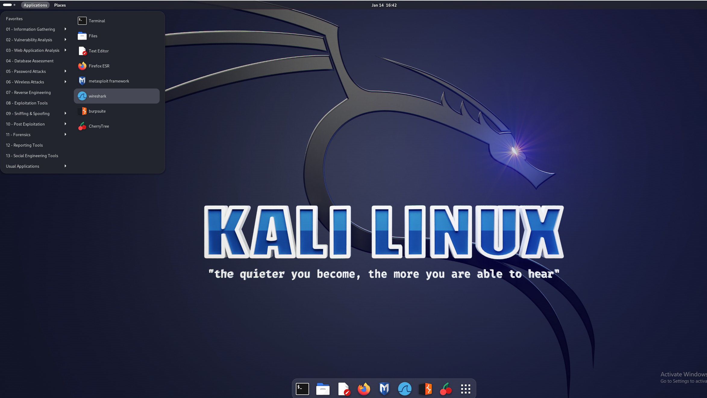

# Wireshark-Packet-Sniffer-Project

In this Wireshark project, I aim to demonstrate proficiency in network analysis and packet inspection. The guide will cover basic Wireshark functionalities along with more advanced techniques such as applying filters and evaluating encrypted traffic. I will showcase ethical hacking practices by including packet sniffing from an intentionally vulnerable website in order to decrypt HTTPS and TLS data

# Part 1: Setup Kali Linux, Starting Wireshark

I downloaded the Kali Linux ISO, validated the checksum, and used VirtualBox to create a virtual machine allocated with 2GB RAM and 20GB disk space. I attached the ISO file as a virtual optical drive and installed Kali with the default options, simply setting a username and password. After a smooth graphical install, I now have a completed Kali Linux VM ready to use. Wireshark is also preinstalled on Kali linux

